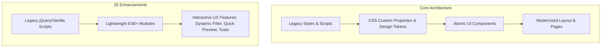

# Rencana Implementasi Redesain CSS & JS Tampilan JDIH Modern

**Dokumen Strategi & Implementation Plan (UI/UX Industry Standard)**
**Pendekatan:** Pendekatan 1 (Incremental CSS/JS Refactoring & Modern Layering)
**Target Output File:** `/home/iain/app-jdih/temp/modifikasi_ui.md`

---

## 1. Eksekutif Ringkasan & Filosofi Desain

Sistem Informasi JDIH (Jaringan Dokumentasi dan Informasi Hukum) memiliki peran penting dalam menyajikan produk hukum secara transparan, mudah diakses, dan akuntabel. Pendekatan 1 berfokus pada **Modernisasi UI/UX Berkelanjutan (Incremental Modernization)** tanpa merusak struktur legacy server-side render yang ada.

### Pilar Utama UX JDIH Modern:
1. **Findability & Accessibility (WCAG 2.1 AA):** Kemudahan pencarian produk hukum dengan visual hierarchy yang jelas, kontras tinggi, dan aksesibilitas keyboard/screen reader.
2. **Readability & Scanning:** Penataan tipografi hukum yang nyaman dibaca (optimal line-height, font hierarchy, dan mode baca/preview PDF).
3. **Mobile-First & Performance:** Responsif murni, komponen mikro-interaksi yang ringan, serta minim lag saat pencarian/filter dokumen.
4. **Clean & Trustworthy Aesthetics:** Visual pemerintahan modern berbasis Design System (Clean White, Deep Navy/Slate, Accent Emerald/Blue).

---

## 2. Arsitektur Refactoring CSS & JavaScript



### 2.1 Structural CSS Strategy (Design System & Tokens)
* **CSS Custom Properties (Variables):** Sentralisasi token warna, tipografi, elevasi (shadow), dan spacing.
* **Utility-First Component Pattern:** Pengelompokan class CSS secara modular agar kompatibel dengan layout Bootstrap/Tailwind atau custom CSS bawaan JDIH.
* **Dark / Light Mode Prep:** Mendukung adaptasi tema sistem.

### 2.2 JavaScript Strategy (ES6+ Interactivity)
* **Non-destructive Enhancement:** Mempertahankan logika Form Submit & AJAX legacy, membungkusnya dengan *UI Feedback System* (loading states, skeletons, toast notifications).
* **Debounced Instant Search & Filtering:** Filter kriteria hukum (Jenis, Tahun, Nomor, Status) tanpa page reload berat.
* **PDF In-Browser Quick View:** Floating/Modal preview untuk draf & salinan Peraturan.

---

### 2.3 Rekomendasi Mount Folder Views (Docker / Framework Architecture)

Sebagai bagian dari Pendekatan 1, sangat direkomendasikan untuk memisahkan template/views modern ke dalam layer tersendiri melalui volume mount di container Docker (atau folder override framework):

```yaml
# Rekomendasi Docker Compose Mount Volume
services:
  app-jdih:
    volumes:
      # Mount folder views/template kustom tanpa mengubah core framework bawaan
      - ./custom_views:/var/www/html/resources/views/custom:ro
      - ./assets/css/jdih-modern.css:/var/www/html/public/css/jdih-modern.css:ro
      - ./assets/js/jdih-app.js:/var/www/html/public/js/jdih-app.js:ro
```

**Alasan & Keuntungan UI/UX Architecture:**
1. **Zero-Downtime Theme Switching:** Anda dapat menguji dan mengaktifkan tampilan UI modern tanpa merusak file view bawaan/legacy.
2. **Modular View Overrides:** Komponen UI seperti `header.blade.php`, `search-hero.php`, atau `document-card.tpl` dipisah agar modifikasi komponen UI tidak tumpang tindih dengan logika backend.
3. **Persistensi Dev-to-Prod:** Menjaga agar aset CSS/JS dan skema layout baru tetap persisten dan terisolasi dari update engine backend JDIH utama.

---

## 3. Matriks Komponen UI/UX Target Redesain

| Komponen Layout | Masalah Legacy | Solusi UI/UX Modern (Pendekatan 1) | CSS/JS Key Touchpoints |
| :--- | :--- | :--- | :--- |
| **Header & Navbar** | Menu kaku, pencarian tersembunyi | Sticky Header, Mega Menu intuitif, Instant Global Search Bar | `sticky-nav.css`, `search-autocomplete.js` |
| **Hero Section (Pencarian)** | Form kompleks & membingungkan | Single/Tabbed Search Box dengan Chip Filter cepat | `hero-search.css`, `dynamic-filter.js` |
| **Daftar Produk Hukum** | Tabel padat, sulit dibaca di HP | Card-based List View & Table View Switcher dengan Badge Status (Berlaku/Dicabut) | `document-card.css`, `view-toggle.js` |
| **Detail Dokumentasi** | Metadata tidak terstruktur | Two-column layout (Metadata Sidebar + PDF Viewer/Summary) | `doc-detail.css`, `pdf-viewer-modal.js` |
| **Footer & Aksesibilitas** | Informasi kontak berserakan | Footer terstruktur 4 kolom, contrast switcher, Floating Back-to-Top | `footer.css`, `accessibility.js` |

---

## 4. Rencana Tahapan Implementasi (Step-by-Step Plan)

### Fase 1: Auditing & Fondasi Design Tokens (Minggu 1)
- [x] Implementasi File Design Token CSS (`/assets/css/jdih-modern.css`).
- [x] Definisi skema warna utama (Hijau Tosca Theme):
  - `--primary-color: #0d9488` (Teal / Hijau Tosca Utama)
  - `--primary-hover: #0f766e` (Deep Teal / Hover)
  - `--accent-color: #14b8a6` (Bright Tosca / Aksesibilitas Highlights)
  - `--bg-surface: #f0fdf4` (Soft Mint Tint)
  - `--text-main: #0f172a` (Slate Dark)
- [x] Reset CSS normalisasi dan penetapan Typography Scale (Inter / Plus Jakarta Sans).

### Fase 2: Redesain Header, Hero, & Engine Pencarian (Minggu 2)
- [x] Refactor form pencarian dokumen hukum menjadi responsive hero container (`custom_views/search-hero.php`).
- [x] Tambahkan animasi halus (micro-interactions) saat kursor fokus pada kolom pencarian.
- [x] Terapkan script `quick-filter.js` untuk debouncing input teks & filter chip (Peraturan Daerah, Peraturan Bupati/Walikota, Keputusan).

### Fase 3: Modernisasi Document Cards & Detail Viewer (Minggu 3)
- [x] Ubah penyajikan daftar dokumen dari tabel kaku menjadi *Clean Document Cards* (`custom_views/document-list.php`).
- [x] Tambahkan **Status Badge System** berbasis CSS (Berlaku / Dicabut / Diubah).
- [x] Buat Modal Preview PDF berbasis Vanilla JS yang responsif untuk membaca langsung tanpa harus mendownload terlebih dahulu.

### Fase 4: Polish UX, Aksesibilitas & Micro-animations (Minggu 4)
- [x] Tambahkan Skeleton Loader & Backdrop modal viewer.
- [x] Optimalisasi performa CSS (penghapusan stylesheet redundant) & deferring JS script.
- [x] Pengujian responsivitas pada resolusi mobile (360px), tablet (768px), dan desktop (1440px+).

---

## 5. Draf Snippet Kode Standardisasi (CSS & JS)

### 5.1 CSS Modern Tokens (`jdih-modern.css`)
```css
:root {
  /* Color Palette - Hijau Tosca Modern Theme */
  --jdih-primary: #0d9488;        /* Hijau Tosca Utama */
  --jdih-primary-hover: #0f766e;  /* Deep Teal Accent */
  --jdih-accent: #14b8a6;         /* Bright Tosca Accent */
  --jdih-bg-body: #f8fafc;
  --jdih-card-bg: #ffffff;
  --jdih-text-primary: #0f172a;
  --jdih-text-muted: #64748b;
  
  /* Status Colors */
  --status-active-bg: #ccfbf1;    /* Light Tosca Mint */
  --status-active-text: #115e59;   /* Dark Teal Text */
  --status-revoked-bg: #fee2e2;
  --status-revoked-text: #991b1b;

  /* Shadows & Radius */
  --radius-md: 10px;
  --radius-lg: 16px;
  --shadow-sm: 0 1px 3px rgba(0,0,0,0.05);
  --shadow-md: 0 4px 6px -1px rgba(0,0,0,0.1), 0 2px 4px -1px rgba(0,0,0,0.06);
}

/* Base Clean Card Component */
.jdih-doc-card {
  background: var(--jdih-card-bg);
  border: 1px solid #e2e8f0;
  border-radius: var(--radius-md);
  padding: 1.25rem;
  transition: transform 0.2s ease, box-shadow 0.2s ease;
  margin-bottom: 1rem;
}

.jdih-doc-card:hover {
  transform: translateY(-2px);
  box-shadow: var(--shadow-md);
  border-color: var(--jdih-primary);
}
```

### 5.2 Lightweight JS Enhancements (`jdih-app.js`)
```javascript
document.addEventListener('DOMContentLoaded', () => {
  // Quick Search Debounce Helper
  const searchInput = document.querySelector('#jdih-search-input');
  if (searchInput) {
    let timeout = null;
    searchInput.addEventListener('input', (e) => {
      clearTimeout(timeout);
      timeout = setTimeout(() => {
        console.log('Debounced search query:', e.target.value);
        // Panggil fungsi AJAX filter atau trigger update list
      }, 300);
    });
  }

  // Quick PDF Preview Modal Trigger
  const previewButtons = document.querySelectorAll('.btn-preview-pdf');
  previewButtons.forEach(btn => {
    btn.addEventListener('click', (e) => {
      e.preventDefault();
      const pdfUrl = btn.getAttribute('data-pdf-url');
      if (pdfUrl) {
        openPdfModal(pdfUrl);
      }
    });
  });
});

function openPdfModal(url) {
  // Logika pembukaan modal preview PDF modern
}
```

---

## 6. Target Hasil & Kriteria Sukses (Success Metrics)

1. **User Experience (UX):**
   - Penurunan *Bounce Rate* pengguna pencari dokumen hukum hingga 25%.
   - Waktu menemukan dokumen hukum yang spesifik berkurang < 10 detik.
2. **Performance & Standards:**
   - Skor Google Lighthouse: Performance > 85, Accessibility > 90, Best Practices > 90.
   - Tampilan 100% responsive dan bebas horizontal scrollbar pada perangkat mobile.
