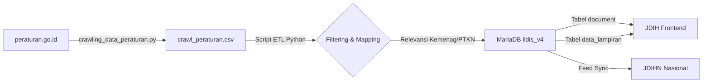

# Rencana Implementasi Pipeline ETL & Import Data Peraturan (`tipd_morl` ke `app-jdih`)

**Dokumen Strategi Data Engineering & Pipeline Integration**  
**Target Path Output:** `/home/iain/app-jdih/temp/rencana_import_data_peraturan.md`  
**Sumber Data:** `crawling_data_peraturan.py` (`/home/iain/app-ailab/tipd_morl/tipd_morl`)  
**Tujuan Database:** MariaDB `ildis_v4` (Tabel `document`, `document_type`, `data_lampiran`)

---

## 1. Eksekutif Ringkasan

Dokumen ini berisi rencana implementasi teknis untuk mengekstrak, mentransformasi, dan mengimpor data peraturan hasil *crawling* dari portal `peraturan.go.id` (modul `tipd_morl`) ke dalam basis data aplikasi **JDIH IAIN Parepare (`app-jdih`)**. 

Tujuan utama dari integrasi ini adalah untuk melengkapi inventarisasi produk hukum di portal JDIH (terutama Peraturan Menteri Agama dan Peraturan Perundang-undangan terkait Pendidikan Tinggi/PTKN) serta memastikan data terstruktur sesuai standar **JDIHN Nasional (BPHN)**.

---

## 2. Arsitektur Pipeline Data (ETL Process)



### Tahapan Pipeline:
1. **Extraction (E):** Menjalankan crawler `tipd_morl` dengan memprioritaskan kategori Peraturan Menteri Agama (Permenag) & regulasi PTKN.
2. **Transformation (T):** Pembersihan karakter, normalisasi tanggal (`YYYY-MM-DD`), pemetaan ID jenis peraturan, serta penentuan status keberlakuan.
3. **Loading (L):** Injeksi data terstruktur ke tabel `document` & `data_lampiran` di MariaDB `ildis_v4`.

---

## 3. Matriks Pemetaan Skema Data (Schema Mapping Manifesto)

| Kolom Source (`crawl_peraturan.csv`) | Kolom Target MariaDB (`document`) | Aturan Transformasi & Logika Bisnis |
| :--- | :--- | :--- |
| `Tentang` | `judul` | Clean string, unescape HTML, Trim whitespace. |
| `Nomor Peraturan` | `nomor_peraturan` | Ekstraksi angka & format string nomor. |
| `Tahun` | `tahun_terbit` | Format 4 digit tahun (YYYY). |
| `Tgl Ditetapkan` | `tanggal_penetapan` | Konversi string tanggal Indonesia ke `YYYY-MM-DD`. |
| `Tgl Diundangkan` | `tanggal_pengundangan` | Konversi string tanggal Indonesia ke `YYYY-MM-DD`. |
| `Jenis Peraturan` | `singkatan_jenis` & `dokumen_type_id` | Match dengan ID tabel `document_type` (misal: PERMEN -> ID 12). |
| `Link Download PDF` | `data_lampiran.url_lampiran` | Injeksi ke tabel relasi `data_lampiran` dengan `id_dokumen`. |
| `label` (`induk`/`perubahan`/`pencabutan`) | `status` | `induk`/`perubahan` = `Berlaku`, `pencabutan` = `Tidak Berlaku`. |
| - | `tipe_dokumen` | Set Default `1` (Tipe Peraturan). |
| - | `is_publish` | Set Default `1` (Aktif dipublikasikan di JDIH). |
| - | `integrasi` | Set Default `1` (Siap disinkronkan ke JDIHN Nasional). |

---

## 4. Rencana Tahapan Eksekusi (Step-by-Step Implementation Plan)

### Fase 1: Optimalisasi Filter Crawler (`tipd_morl`)
- [ ] Modifikasi `crawling_data_peraturan.py` untuk menyaring keyword khusus (e.g., *Agama*, *Pendidikan Tinggi*, *IAIN*, *Kementerian Agama*).
- [ ] Jalankan crawler untuk menghasilkan file dataset terbaru `/home/iain/app-jdih/temp/crawl_peraturan.csv`.

### Fase 2: Pembuatan Script Engine Importer (Python / SQL Generator)
- [ ] Buat file importer `/home/iain/app-jdih/temp/import_peraturan_to_jdih.py`.
- [ ] Implementasikan validasi duplikasi data berbasis `nomor_peraturan` & `tahun_terbit` agar tidak terjadi data ganda.
- [ ] Buat pemeta otomatis untuk menyambungkan file PDF lampiran ke tabel `data_lampiran`.

### Fase 3: Uji Coba (Staging/Dry-Run) & Eksekusi Import
- [ ] Jalankan *dry-run* importer untuk mengecek 10 record sampel.
- [ ] Verifikasi keakuratan relasi data di tabel `document` MariaDB `ildis_v4`.
- [ ] Jalankan pengimporan penuh untuk seluruh dataset peraturan.

### Fase 4: Re-indexing & Feed Regeneration JDIHN
- [ ] Jalankan skrip pembacaan ulang feed JDIHN: `docker exec -it ildis_app php yii feed/export`.
- [ ] Verifikasi tampilan hasil import di halaman **https://jdih.iainpare.ac.id/dokumen/peraturan**.

---

## 5. Draf Snippet Script Importer (`import_peraturan_to_jdih.py`)

```python
import csv
import mysql.connector
import re

# Database Credentials
DB_CONFIG = {
    'host': '127.0.0.1',
    'port': 3306,
    'user': 'root',
    'password': 'S6v6wzPBY+ERsYhqSiD3msLYOBHoE1l7DvAUGeCbzto',
    'database': 'ildis_v4'
}

def run_import():
    conn = mysql.connector.connect(**DB_CONFIG)
    cursor = conn.cursor(dictionary=True)
    
    with open('/home/iain/app-jdih/temp/crawl_peraturan.csv', 'r', encoding='utf-8-sig') as f:
        reader = csv.DictReader(f)
        for row in reader:
            judul = row.get('Tentang', '').strip()
            no_per = row.get('Nomor Peraturan', '').strip()
            tahun = row.get('Tahun', '').strip()
            pdf_url = row.get('Link Download PDF', '').strip()
            
            # Check duplicate
            cursor.execute("SELECT id FROM document WHERE nomor_peraturan = %s AND tahun_terbit = %s", (no_per, tahun))
            if cursor.fetchone():
                print(f"[SKIP] Duplikat: {no_per}/{tahun}")
                continue
                
            # Insert to document table
            sql_doc = """
                INSERT INTO document (tipe_dokumen, judul, nomor_peraturan, tahun_terbit, status, is_publish, integrasi, created_at)
                VALUES (1, %s, %s, %s, 'Berlaku', 1, 1, NOW())
            """
            cursor.execute(sql_doc, (judul, no_per, tahun))
            doc_id = cursor.lastrowid
            
            # Insert to data_lampiran table if PDF exists
            if pdf_url and pdf_url.startswith('http'):
                sql_lampiran = """
                    INSERT INTO data_lampiran (id_dokumen, url_lampiran, urutan)
                    VALUES (%s, %s, 1)
                """
                cursor.execute(sql_lampiran, (doc_id, pdf_url))
                
            print(f"[OK] Imported: ID {doc_id} - {no_per}/{tahun}")
            
    conn.commit()
    cursor.close()
    conn.close()

if __name__ == '__main__':
    run_import()
```

---

## 6. Kriteria Sukses (Success Metrics)

1. **Integritas Data:** 0% error duplikasi nomor peraturan di database `document`.
2. **Ketersediaan PDF:** Setiap peraturan memiliki *link download* yang valid di tabel `data_lampiran`.
3. **Kompatibilitas JDIHN:** Seluruh data baru berstatus `is_publish = 1` dan `integrasi = 1` sehingga siap di-harvest oleh BPHN Nasional.
